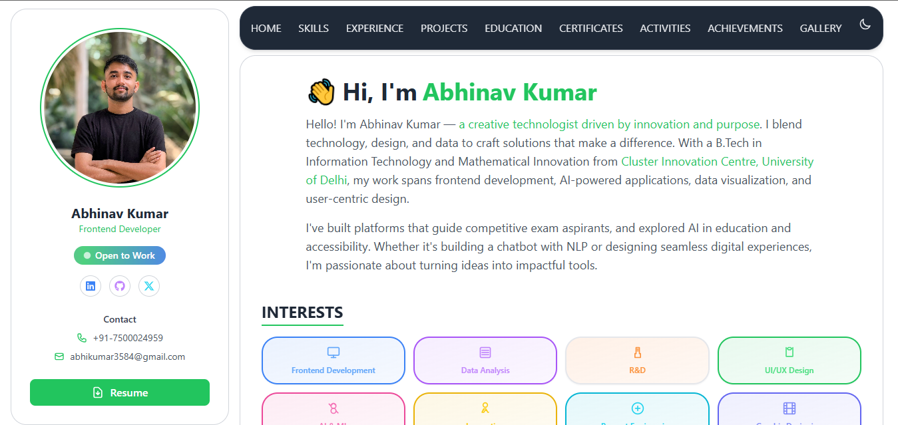

# 🚀 Abhinav Kumar - Portfolio Website

A modern, responsive portfolio website built with React and Tailwind CSS, showcasing my professional journey, skills, projects, and achievements.

## 🌐 Live Demo

**[Visit Portfolio](https://abhikumar.vercel.app/)**

## 📸 Screenshots

### Home View - DARK MODE


### Alternative Home View - LIGHT MODE


## ✨ Features

- **🎨 Modern UI/UX**: Clean, professional design with smooth animations
- **🌙 Dark/Light Mode**: Toggle between themes for better user experience  
- **📱 Fully Responsive**: Optimized for all devices (mobile, tablet, desktop)
- **⚡ Fast Performance**: Built with React for optimal loading speeds
- **📄 Resume Integration**: LaTeX-generated PDF resume with download functionality
- **🖼️ Interactive Gallery**: Showcase of personal and professional moments
- **📊 Skills Visualization**: Dynamic representation of technical skills
- **💼 Project Showcase**: Detailed project presentations with links
- **🏆 Certifications**: Display of professional certifications and achievements

## 🛠️ Tech Stack

- **Frontend Framework**: React 18.2.0
- **Styling**: Tailwind CSS 3.3.3
- **Build Tool**: React Scripts 5.0.1
- **CSS Processing**: PostCSS with Autoprefixer
- **Resume**: LaTeX (compiled to PDF)
- **Deployment**: Vercel
- **Package Manager**: npm

## 📂 Project Structure

```
portfolio/
├── public/                    # Static assets
│   ├── index.html
│   ├── Abhinav_Kumar_Resume.pdf
│   └── [logos & images]
├── src/
│   ├── components/           # React components
│   │   ├── Header.jsx       # Main header section
│   │   ├── Navbar.jsx       # Navigation component
│   │   ├── Sidebar.jsx      # Profile sidebar
│   │   ├── SkillsSection.jsx
│   │   ├── ExperienceSection.jsx
│   │   ├── ProjectsSection.jsx
│   │   ├── CertificationsSection.jsx
│   │   ├── EducationSection.jsx
│   │   ├── HobbiesSection.jsx
│   │   ├── ActivitiesSection.jsx
│   │   ├── GallerySection.jsx
│   │   ├── Footer.jsx
│   │   ├── BottomActions.jsx
│   │   └── main.tex         # LaTeX resume source
│   ├── context/
│   │   └── ThemeContext.js   # Dark/Light theme management
│   ├── utils/
│   │   └── analytics.js      # Analytics utilities
│   ├── assets/
│   │   └── images/          # Image assets
│   ├── App.js               # Main application component
│   ├── index.js             # Application entry point
│   └── index.css            # Global styles
├── build/                   # Production build
├── screenshot/              # Application screenshots
├── package.json
├── tailwind.config.js
├── postcss.config.js
└── vercel.json             # Vercel deployment config
```

## 🚀 Getting Started

### Prerequisites

- Node.js (v14 or higher)
- npm or yarn
- Git

### Installation

1. **Clone the repository**
   ```bash
   git clone https://github.com/Abhinavkumar3584/PORTFOLIO.git
   cd PORTFOLIO
   ```

2. **Install dependencies**
   ```bash
   npm install
   ```

3. **Start development server**
   ```bash
   npm start
   ```

4. **Open in browser**
   ```
   http://localhost:3000
   ```

### Build for Production

```bash
npm run build
```

### Compile LaTeX Resume

```bash
pdflatex -output-directory=src/components src/components/main.tex
```

### Theme Customization
Edit `tailwind.config.js` to customize colors, fonts, and spacing:

```javascript
module.exports = {
  content: ["./src/**/*.{js,jsx,ts,tsx}"],
  darkMode: 'class',
  theme: {
    extend: {
      // Add your custom theme configurations
    },
  },
  plugins: [],
}
```

### Adding New Sections
1. Create a new component in `src/components/`
2. Import and add to `App.js`
3. Update navigation in `Navbar.jsx`

## 🌐 Deployment

The site is deployed on Vercel with automatic deployments from the main branch.

### Deploy to Vercel
1. Connect your GitHub repository to Vercel
2. Configure build settings (already configured in `vercel.json`)
3. Deploy automatically on every push to main

### Alternative Deployment Options
- **Netlify**: Drag and drop the `build` folder
- **GitHub Pages**: Use `gh-pages` package
- **Firebase Hosting**: Use Firebase CLI

## 📄 Resume

The resume is generated using LaTeX and automatically compiled to PDF. To update:

1. Edit `src/components/main.tex`
2. Run the LaTeX compilation task in VS Code
3. The PDF will be generated in the components directory

## 🤝 Contributing

1. Fork the project
2. Create your feature branch (`git checkout -b feature/AmazingFeature`)
3. Commit your changes (`git commit -m 'Add some AmazingFeature'`)
4. Push to the branch (`git push origin feature/AmazingFeature`)
5. Open a Pull Request

## 📞 Contact

**Abhinav Kumar**
- 📧 Email: [your-email@example.com]
- 🔗 LinkedIn: [your-linkedin-profile]
- 🐙 GitHub: [@Abhinavkumar3584](https://github.com/Abhinavkumar3584)
- 🌐 Portfolio: [https://abhikumar.vercel.app/](https://abhikumar.vercel.app/)

## 📝 License

This project is open source and available under the [MIT License](LICENSE).

## 🙏 Acknowledgments

- React community for the amazing framework
- Tailwind CSS for the utility-first approach
- Vercel for seamless deployment
- All the open-source contributors

---

⭐ **Star this repository if you found it helpful!**

---

*Last updated: August 2025*
